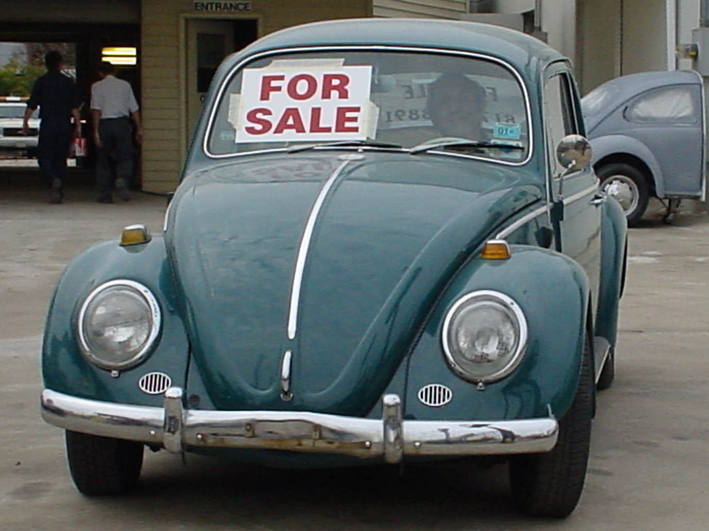
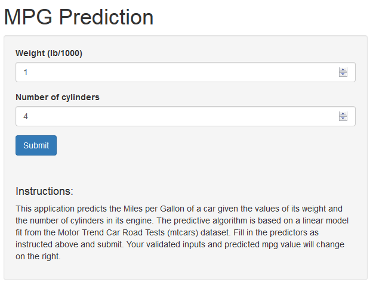

## The problem

When purchasing a used car, it can be very difficult to predict its miles per gallon based on the limited information available.

<div style='text-align: center;'>
    
</div>

--- 

## mpg ~ wt + cyl
As the weight and cylinder count increase, MPG decreases

```{r fig.width=7, echo=FALSE, fig.height=7}
data(mtcars);library(ggplot2);qplot(wt,mpg,colour=factor(cyl),data=mtcars)
```

--- 

## The solution

Using the weight of the car and the number of cylinders of the car, we can predict its likely miles per gallon using historical auto data available in the R package.

```{r fig.width=7,echo=FALSE, fig.height=7}
par(mfrow = c(2, 2))
plot(lm(mpg~wt+cyl,mtcars))
```

--- 

## Try it @ raz2raz.shinyapps.io/part1

[MPG Predictor](http:/raz2raz.shinyapps.io/part1/)

<a href="http:/raz2raz.shinyapps.io/part1/" target="_blank">
<div style='text-align: center; border: 1px solid black'>
    
</div>
</a>

